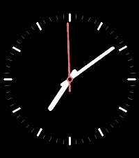

# aura-pebble

Watchfaces for the **Pebble Time 2**, carrying the identity of **Aura** — my personal
weather app for Spain (built on AEMET OpenData; the iOS/macOS app is `aura-apps`, the Android
app is `aura-android`). Free and open source, distributed on the
[Pebble appstore](https://apps.repebble.com/faces).

> "Pebble" here is [Core Devices](https://repebble.com), the 2025 relaunch — not the original
> 2016 company. The SDK and C API are inherited from that lineage (PebbleOS is open source at
> [coredevices/pebbleos](https://github.com/coredevices/pebbleos)).

## Why this is its own project

Aura on the phone renders ~250 illustrated weather scenes over a live sky. A Pebble app gets
~128 KB of code and ~256 KB of resources on a 200×228, 64-colour screen — so none of that art
or logic ports. What carries over is Aura's **design language**: its weather-driven colour
ramps (temperature, wind, air quality, UV) and its habit of showing one glanceable thing well.
The faces here are standalone clocks in that language; live weather is a later, optional
phone-bridged feature.

## Faces

| Face | What it is | Status |
|------|------------|--------|
| **aura-digital** | Minimalist digital face — step count, time, date, and battery, with an accent colour that tracks the time of day (echoing Aura's sun-tracking sky). | Phase 1 |
| **aura-analog** | Analog face reproducing the Swiss-Railways **stop-to-go** seconds mechanic (the hand sweeps a full turn in ~58 s, then pauses at 12 for ~2 s and releases as the minute jumps), on an original dark Aura dial. | Phase 2 |

Digital (Phase 1) and analog (Phase 2), on the Pebble Time 2 emulator:

 

## Build & run

Needs the Pebble SDK (`pebble-tool`, installed via [`uv`](https://docs.astral.sh/uv/)):

```bash
uv tool install pebble-tool
pebble sdk install latest

cd aura-digital
pebble build                      # -> build/aura-digital.pbw
pebble install --emulator emery   # Emery = Pebble Time 2 (retry once if it says "Connection refused")
```

To run on a real watch, enable **Dev Connect** in the Pebble phone app, then
`pebble install --cloudpebble`.

## Docs

- [`CLAUDE.md`](CLAUDE.md) — toolchain commands, build settings, and the phase roadmap.
- [`docs/PALETTE.md`](docs/PALETTE.md) — Aura's colour ramps re-encoded to the 64-colour Pebble palette.
- [`docs/DISTRIBUTION.md`](docs/DISTRIBUTION.md) — how a face gets published to apps.repebble.com.

## Credit

Built with [Claude Code](https://claude.com/claude-code).

## License

MIT — see [LICENSE](LICENSE).
