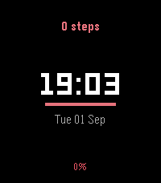
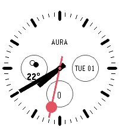
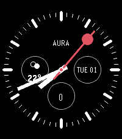

# aura-pebble

Watchfaces for the **Pebble Time 2**, carrying the identity of **Aura** — my personal
weather app for Spain (built on AEMET OpenData; the iOS/macOS app is `aura-apps`, the Android
app is `aura-android`). Free and open source, distributed on the
[Pebble appstore](https://apps.repebble.com/faces).

> "Pebble" here is [Core Devices](https://repebble.com), the 2025 relaunch — not the original
> 2016 company. The SDK and C API are inherited from that lineage (PebbleOS is open source at
> [coredevices/pebbleos](https://github.com/coredevices/pebbleos)).

## Why this is its own project

Aura on the phone renders ~250 illustrated weather scenes over a live sky. A Pebble app gets
~128 KB of code and ~256 KB of resources on a 200×228, 64-colour screen — so none of that art
or logic ports. What carries over is Aura's **design language**: its weather-driven colour
ramps (temperature, wind, air quality, UV) and its habit of showing one glanceable thing well.
The faces here are standalone clocks in that language; the analog face adds an optional live
weather complication, fed from the phone.

## Faces

| Face | What it is | Status |
|------|------------|--------|
| **aura-digital** | Minimalist digital face — step count, time, date, and battery, with an accent colour that tracks the time of day (echoing Aura's sun-tracking sky). | Phase 1 |
| **aura-analog** | A Swiss-railway clock with the **stop-to-go** second hand (sweeps a full turn in ~58 s, pauses at 12 for ~2 s, then releases as the minute jumps): white or black dial, black/white baton hands, red lollipop second hand, and three chronograph subdials — live weather (left), day as `WWW DD` (right), and steps or heart rate (bottom) — under an AURA wordmark. Configurable ([Settings](#settings)). See [Design origin](#design-origin). | Phase 2 |

Digital (Phase 1), then the analog face (Phase 2) on its light and low-power black dials, on the Pebble Time 2 emulator:

  

## Build & run

Needs the Pebble SDK (`pebble-tool`, installed via [`uv`](https://docs.astral.sh/uv/)):

```bash
uv tool install pebble-tool
pebble sdk install latest

cd aura-digital
pebble build                      # -> build/aura-digital.pbw
pebble install --emulator emery   # Emery = Pebble Time 2 (retry once if it says "Connection refused")
```

To run on a real watch, enable **Dev Connect** in the Pebble phone app, then
`pebble install --cloudpebble`.

## Settings

The analog face has a settings screen (open it from the Pebble phone app), built with
[Clay](https://github.com/pebble-dev/clay). From there you can choose the black dial (lower
power on OLED), toggle the second hand, the AURA wordmark, and whether the bottom subdial
shows steps or heart rate, and set weather units.

Weather comes from [Open-Meteo](https://open-meteo.com) — no API key, so it stays free for
anyone. The phone (PebbleKit JS) fetches the current temperature and condition for your GPS
location, or a latitude/longitude you enter manually, and pushes them to the watch, refreshing
every 30 minutes. The face works fine offline — the weather subdial just reads `--°` until a
reading arrives.

## Docs

- [`docs/PALETTE.md`](docs/PALETTE.md) — Aura's colour ramps re-encoded to the 64-colour Pebble palette.
- [`docs/DISTRIBUTION.md`](docs/DISTRIBUTION.md) — how a face gets published to apps.repebble.com.

## Design origin

The analog face is a homage to the Mondaine "Official Swiss Railways" clock and its *stop2go*
second hand. The Mondaine name and that dial design are protected trademarks / registered
designs of Mondaine Watch Ltd; this is an independent, non-commercial reimplementation for
PebbleOS, not affiliated with or endorsed by Mondaine or SBB. All code here is original.

## Built with

[Claude Code](https://claude.com/claude-code) (Anthropic).

## License

MIT — see [LICENSE](LICENSE).
