# aura-pebble

Watchfaces for the **Pebble Time 2** carrying the identity of **Aura**, my personal weather app for Spain (built on AEMET OpenData; the iOS and macOS app is `aura-apps`, the Android app is `aura-android`). Free and open source, distributed on the [Pebble appstore](https://apps.repebble.com/faces).

> "Pebble" here means [Core Devices](https://repebble.com), the 2025 relaunch, not the original 2016 company. The SDK and C API come from that lineage (PebbleOS is open source at [coredevices/pebbleos](https://github.com/coredevices/pebbleos)).

## Why this is its own project

Aura on the phone draws around 250 illustrated weather scenes over a live sky. A Pebble app gets about 128 KB of code and 256 KB of resources on a 200×228, 64-colour screen, so none of that art or logic ports. What carries over is Aura's design language: the weather-driven colour ramps (temperature, wind, air quality, UV) and the habit of showing one glanceable thing well. The faces here are standalone clocks in that language, and the analog face adds an optional live weather complication fed from the phone.

## Faces

| Face | What it is | Status |
|------|------------|--------|
| **aura-digital** | Minimalist digital face: step count, time, date and battery, with an accent colour that tracks the time of day (echoing Aura's sun-tracking sky). | Phase 1 |
| **aura-analog** | A Swiss-railway chronograph with the **stop-to-go** second hand (it sweeps a full turn in about 58 s, pauses at 12 for about 2 s, then releases as the minute jumps): white or black dial, black or white baton hands, twelve identical bold hour markers, and a red lollipop second hand. Four subdials, at 12, 9, 3 and 6, each set to whatever you want: the AURA wordmark, live weather, the day (red on Sundays), the date, battery, steps, heart rate, or nothing ([Settings](#settings)). See [Design origin](#design-origin). | Phase 2 |
| **aura-essential** | A digital face in three blocks after the classic "Essential" layout: a top block with three configurable complications (steps, heart rate, battery, day of the week or weather) drawn as white icons with a black outline and flat segmented (LECO) numbers, a large clock centred in a white band, and a colour strip below. Every block colour, the separator and the clock font are configurable ([Settings](#settings)). | [Live on the appstore](https://apps.repebble.com/aura-essential_19335d2e746b4d6aa6ba8c63) |

The Essential face on the Pebble Time 2 emulator, in five of its themes (every block colour and complication is configurable):

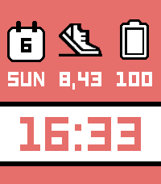 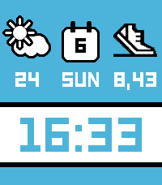 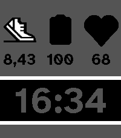 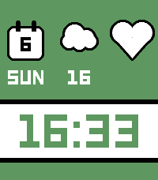 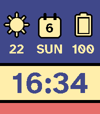

Aura Essential is live on the Pebble appstore at [apps.repebble.com/aura-essential](https://apps.repebble.com/aura-essential_19335d2e746b4d6aa6ba8c63). Install it straight to a Pebble Time 2 from the Pebble phone app.

## Aura Weather (watchapp)

Aura Weather is a standalone weather watchapp, not a face: a paged deck of cards you page through with the up and down buttons, every card optional and reorderable from its settings. The phone fetches live weather over the JS bridge (Open-Meteo worldwide with no API key, plus an AEMET path for Spain) and the watch renders each card natively in Aura's colour language at 200×228. It runs on its own, with no companion app on the phone.

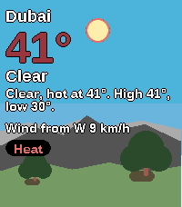 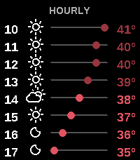 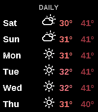 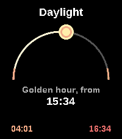 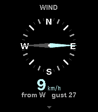 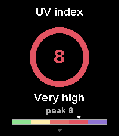 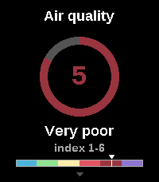 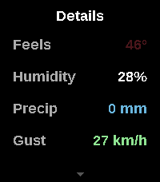 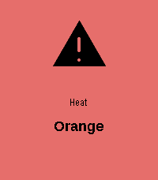

The hero card leads with the current conditions over a time-of-day sky: a big temperature, a plain-language forecast sentence, and the wind read as words, the way the phone and watch apps say it. The cards that follow, in their default order: the hourly forecast, the multi-day forecast, sun and moon (sunrise and sunset with the golden-hour and blue-hour windows by day, or the moon phase and illumination at night), wind on a compass rose, the UV index, air quality on the 1-6 European index, and a details card (feels-like, humidity, precipitation and gust). The scale cards (wind, UV, air, details) open an Aura colour legend on a long press of the select button. In Spain an aviso card carries the official AEMET warning when one is live, and a forecast card carries the full AEMET boletin.

## Build and run

Needs the Pebble SDK (`pebble-tool`, installed with [`uv`](https://docs.astral.sh/uv/)):

```bash
uv tool install pebble-tool
pebble sdk install latest

cd aura-digital
pebble build                      # -> build/aura-digital.pbw
pebble install --emulator emery   # Emery = Pebble Time 2 (retry once if it says "Connection refused")
```

To run on a real watch, enable **Dev Connect** in the Pebble phone app, then `pebble install --cloudpebble`.

## Settings

The analog and Essential faces each have a settings screen (open it from the Pebble phone app), built with [Clay](https://github.com/pebble-dev/clay). On aura-analog you can pick the black dial, turn the second hand on or off, choose what each of the four subdials shows (nothing, the AURA wordmark, weather, the day, the date, battery, steps or heart rate), and set the weather units. On aura-essential you choose what each of the three top complications shows, the colour of each block, the separator colour, and the clock font.

Weather comes from [Open-Meteo](https://open-meteo.com), which needs no API key, so it stays free for anyone. The phone side (PebbleKit JS) fetches the current temperature and condition for your GPS location, or for a latitude and longitude you type in, and pushes them to the watch every 30 minutes. The condition shows as a real weather symbol (from the [Weather Icons](https://github.com/erikflowers/weather-icons) font) mapped from the WMO code. The face still works offline; the weather subdial just reads `--°` until a reading arrives.

## Docs

- [`docs/PALETTE.md`](docs/PALETTE.md): Aura's colour ramps re-encoded to the 64-colour Pebble palette.
- [`docs/DISTRIBUTION.md`](docs/DISTRIBUTION.md): how a face gets published to apps.repebble.com.

## Design origin

The analog face is a homage to the Mondaine Grand Cushion Set Black, a cushion-cased chronograph on the classic Swiss-railway dial, and its *stop2go* second hand: white dial, black baton hands, twelve identical bold markers, the red lollipop second hand, and subregisters at 12, 9, 3 and 6. The Mondaine name and dial design are protected trademarks and registered designs of Mondaine Watch Ltd; this is an independent, non-commercial reimplementation for PebbleOS, not affiliated with or endorsed by Mondaine or SBB. All the code here is original.

The Essential face is a homage to the original [**Essential**](https://apps.repebble.com/essential_55cf75fc61e031bb4b000025) watchface for Pebble by **Kiezel**, on the appstore since 2015 and unmaintained since 2016: three blocks, white-icon complications with a black outline over a colour block, and a large segmented clock in a white band. The step-count shoe icon is reproduced from that face's own artwork; credit and thanks go to Kiezel. All the code here is original.

## Fonts

The analog dial is set in **Liberation Sans** (metric-compatible with Helvetica), and the weather conditions use the **Weather Icons** symbol font. Both are under the SIL Open Font License 1.1, bundled and subset to the glyphs actually used, under [`aura-analog/resources/fonts/`](aura-analog/resources/fonts) with their licenses.

- Liberation Sans, © Red Hat, Inc., SIL OFL 1.1.
- Weather Icons, © Erik Flowers, SIL OFL 1.1.

The Essential face draws its numbers in the Pebble system **LECO** font, and its weekday word in **LECO 1976 Regular** by Samuel Čarnoký (CarnokyType) — the display face the system LECO is modelled on, which unlike the system font also carries letters. It is bundled and subset to the glyphs used under [`aura-essential/resources/fonts/`](aura-essential/resources/fonts). Unlike the analog fonts it is not open-licensed: LECO 1976 Regular is offered free of charge on MyFonts under its Desktop and App licenses, which is how it is used here.

- LECO 1976 Regular, © Samuel Čarnoký / CarnokyType, free MyFonts Desktop + App license.

## Built with

[Claude Code](https://claude.com/claude-code) (Anthropic).

## License

MIT. See [LICENSE](LICENSE).
